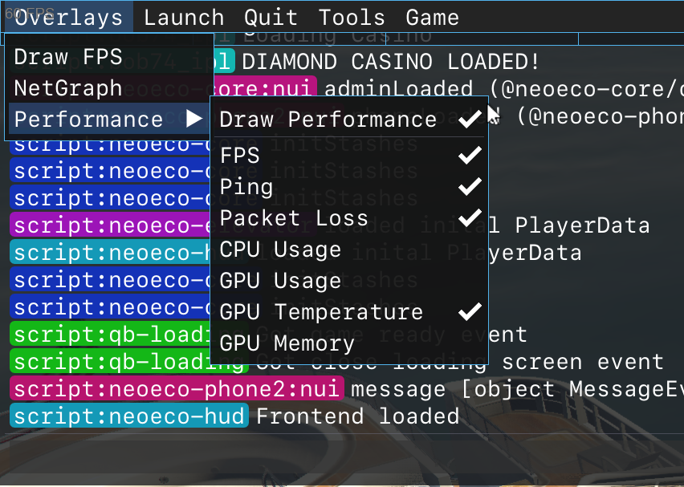
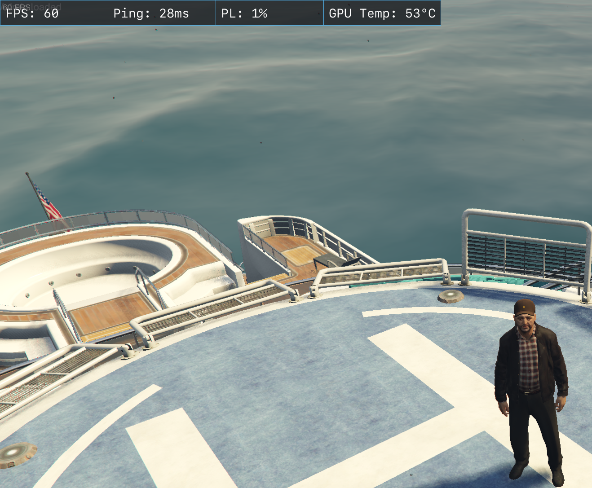
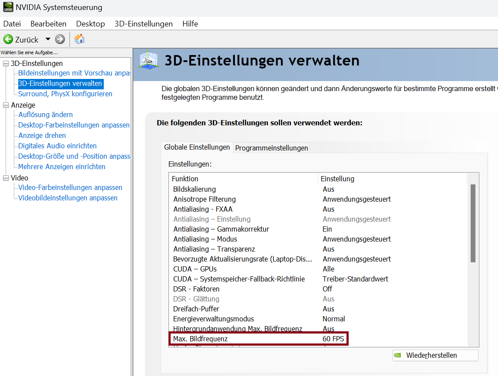

# Diagnosewerkzeug unter [F8]

# FPS

1. FPS = frames per second 
- Sollte mindestens bei 60 sein

**Es ist natürlich schön wenn deine Grafikkarte theoretisch 200 FPS bei diesem Spiel schafft, bedenke aber das deine Grafikkarte auch mehr Wärme entwickelt weil sie die FPS da durch drücken muss. (FPS begrenzen kann helfen)**

2. Ping = weniger ist immer mehr 🙂

3. PL = packet loss = Datenpakete gehen verloren

3. Begrenzen der FPS "Nvidia Systemsteuerung"

