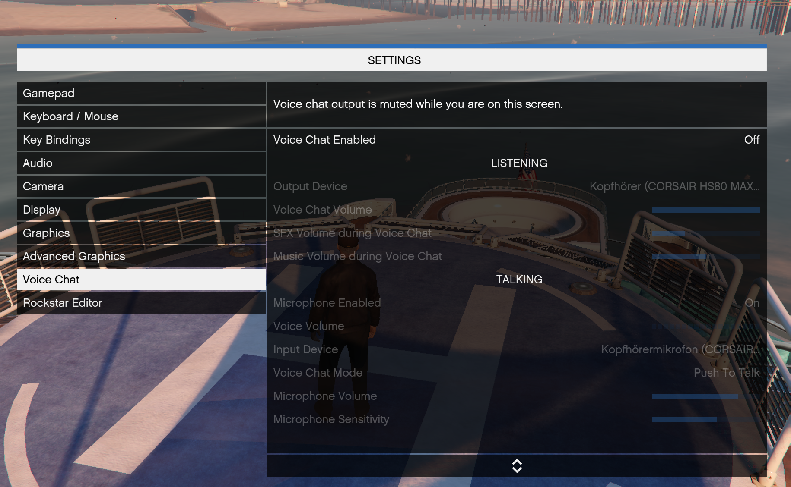
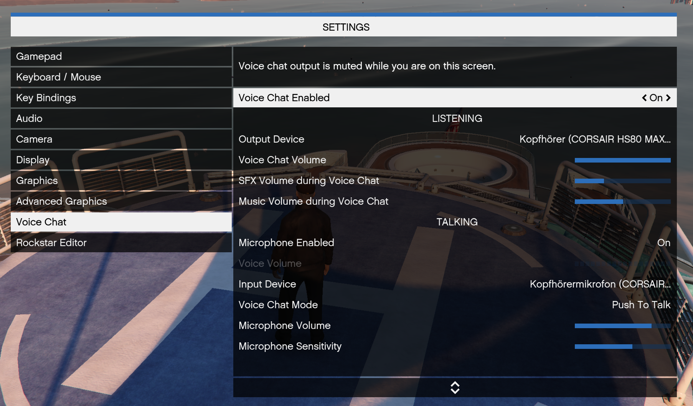
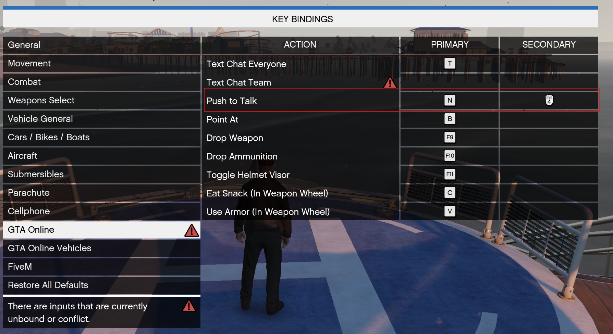

# Ingame Voice Konfiguration

## Settings > Voice Chat > Voice Chat Enabled

## Bitte das richte "Output Device" und "Input Device" auswählen / Hier kann dann auch gleich Push to Talk eingerichtet werden

## Push to Talk
## [ESC] > "Tastaturbelegung" > "GTA Online"

**Tipp: über Einstellungen > Audio > Stummschaltung bei Fokusverlust AUS, kann man verhindern, dass wenn man aus dem Spiel tabt, kein Sound mehr da ist.**