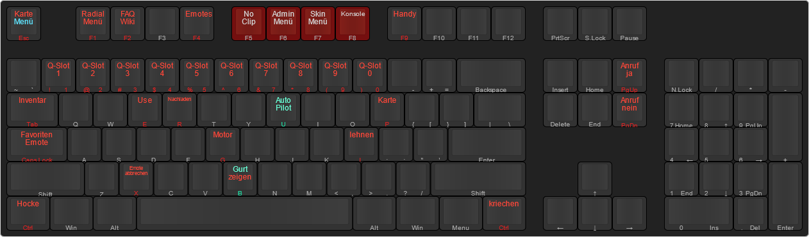

# Tastaturbelegung

## Emote Menü [F4]
- F4 = Öffnen/Schließen Emotes Menü
- B = Finger zeigen
- Y = Hände hoch
- U = Ragdoll
- Linke STRG = Ducken aktivieren/deaktivieren    (/crouch)
- Rechte STRG = Krabbeln aktivieren/deaktiveren  (/crawl)
- Gehstile: /walks (Anzeigen), /reset walk (Zurücksetzen)
- Stimmungen: /moods (Anzeigen), /reset moods (Zurücksetzen)
- Kamerabewegung (Kinomodus): /Idlecamon (Anschlaten), /Idlecamoff (Ausschalten)
- Fernglas: /binoculars (Nutzen), Linke Alt = Nachtsicht/Wärmesicht (Toggle)
- Fernsehkamera: /newscam (Kamera-Start), H = Text bearbeiten, Linke ALT = Nachtsicht/Wärmesicht (Toggle)

## Police Grabbler [F1] (Wenn Police Job)
- /grappler install - Anbringen des Grapplers
- /grappler deploy - Auslösen des Grapplers
- /grappler reset - Einziehen/Aufrollen des Grapplers
- /grappler remove - Komplettes entfernen des Grapplers (__**erst nach dem Reset ausführen!!!**__)

## AI Taxi [F1] (Jeder)
- Taxi rufen = /taxi
- Einsteigen und Wegmarke auf der Karte festlegen
- Dem Fahrer sagen dass er fahren soll = /taxigo
- Kontrollen: Schneller fahren befehlen = /taxifast, Langsamer fahren befehelen = /taxislow
- Dem Fahrer mitteilen, dass er jetzt sofort hier anhalten soll: /taxi
- Aussteigen und Geld wird automatisch abgezogen.

## Support [F1] (Jeder)
- Support anfordern = /adminreport